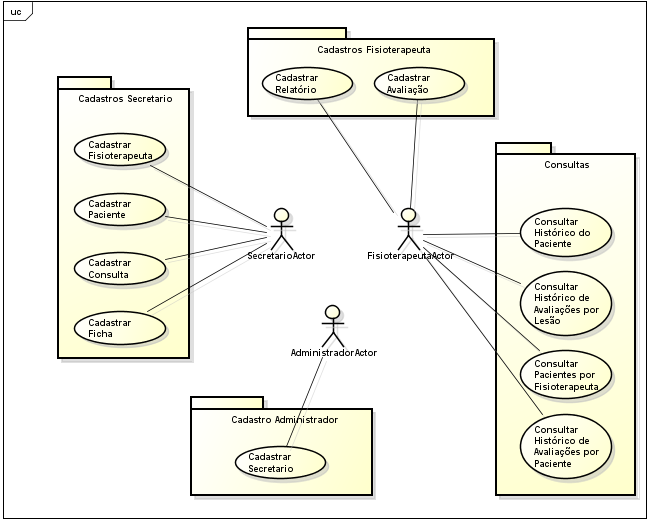
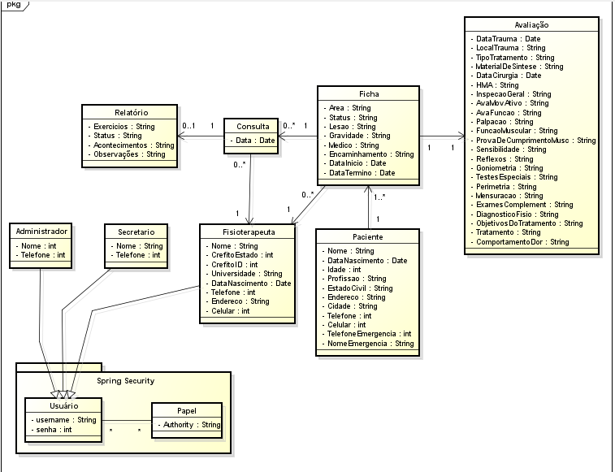

# Clinica de Fisioterapia

##Descrição do Projeto
Nosso projeto visa atender as necessidades reais da Clinica de Fisioterapia do Centro Universitário Barão de Mauá que atualmente tem seus procedimentos e fichas arquivados de maneira não digital.

O sistema funciona com três papéis de autenticação diferentes: administrador, secretário e fisioterapeuta. O administrador tem como função apenas cadastrar um secretário. O secretário tem como função o cadastro das informações de um paciente, sua ficha, do fisioterapeuta e das consultas. Por fim o fisioterapeuta tem como função o cadastro dos relatórios das consultas e das avaliações de lesão.

O projeto foi desenvolvido utilizando o framework Grails. O diagrama de classes e o diagrama de casos de uso pode ser visto no GitHub.

## Técnologia
### Grails
O projeto foi desenvolvido usando o Grails 3.1.4. Para executá-lo, o processo mais simples é utilizar o IntelliJ Ultimate Edition.

### Heroku
O projeto foi hospedado no Heroku. Além de rodar o projeto manualmente, é possível acessá-lo na URL [fisio.herokuapp.com](https://fisio.herokuapp.com/). A política deles é suspender instâncias que fiquem idle por 30 minutos. Assim, durante o primeiro acesso ao site, é possível que uma página 404 seja retornada. O processo de boot da instância e do projeto Grails pode demorar até 2 minutos. Atualize a página até ser bem sucedido.

##CRUD
Todas as entidades do diagrama de classe com excessão de usuário e papel tem seus CRUDs completos implementados.

##Autenticação
Foi implementada com diferentes privilégios para cada papel:

###Administrador
CRUD completo de Administrador e Secretário.

###Secretário
CRUD completo de Paciênte, Fisioterapeuta, Ficha e Consulta.

###Fisioterapeuta
CRUD completo de Relatório e Avaliação; e pode ver Consulta e Ficha.

##Funcionalidades
Consultar histórico do paciente (buscar todas as consultas de um paciente)
Consultar histórico de avaliações por lesão
Consultar histórico de avaliações por paciente
Consultar pacientes por fisioterapeuta

##Internacionalização
Internacionalização implementada. Idiomas disponíveis: inglês e português. 
Obs.: ComboBoxes com opções estáticas como [Estado Cívil: "Solteiro"; "Casado"] não tem tradução para as opções.

##Estruturação do Projeto
O projeto foi baseado na estrutura MVC.

##Documentação:

